# P-Project 1: Seoul Bike Sharing Analysis — Clustering, EDA & Machine Learning (Python)

This project performs a full **data analytics and machine learning workflow** on the **Seoul Bike Sharing dataset**.  
It includes **EDA**, **K-means & hierarchical clustering**, and multiple **predictive models**  
(SVM, Random Forest, Gradient Boosting, Linear Regression) to understand and forecast rental behavior.

* **Dataset:** Seoul Bike Sharing (8,760 rows × 14 features)  
* **Tools:** Python, pandas, NumPy, seaborn, matplotlib, scikit-learn, scipy, statsmodels  
* **Techniques:** EDA, histograms, scatterplots, heatmaps, clustering (K-means & Ward), classification models, regression  
* **Goal:** Identify rental patterns, uncover cluster structures, and build prediction models.

---

## 📁 Dataset Overview

The dataset includes:

- **Rented Bike Count**  
- **Date**, **Hour**  
- **Temperature**, **Humidity**, **Wind Speed**, **Visibility**  
- **Dew Point Temperature**, **Solar Radiation**, **Rainfall**, **Snowfall**  
- **Holiday**, **Functioning Day**, **Season**

  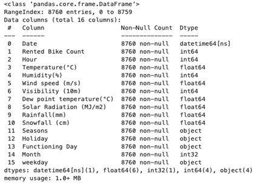
  
<em>Dataset structure and features.</em>

---

## 🧹 Data Cleaning & Feature Preparation

- No missing values  
- Extracted **Month** and **Weekday** features  
- One-hot encoded: Holiday, Functioning Day, Season  
- Selected weather variables for clustering:
  - Temperature, Wind Speed, Visibility  
  - Dew Point Temperature  
  - Solar Radiation  
  - Rainfall, Snowfall  

  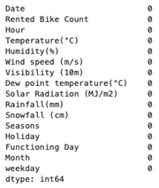
  
<em>No missing values in the dataset.</em>

---

# 📊 **Part 1 — Exploratory Data Analysis (EDA)**

## 📈 Histograms  
Temperature, wind speed, visibility, and rental counts.

  

  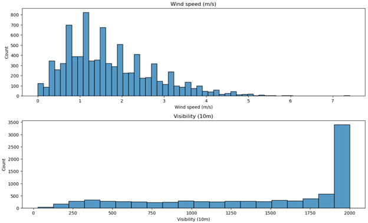

  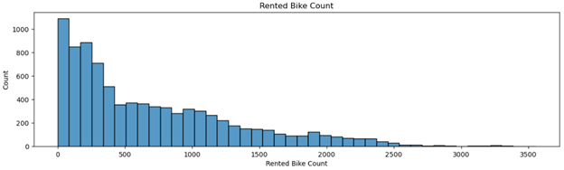

### Key Patterns  
- Rentals highly skewed (many low-rent hours)  
- Temperature peaks around 20°C  
- Visibility peaks at 2,000m  
- Wind speed mostly 0–2 m/s  

---

## 🔍 Scatterplots

  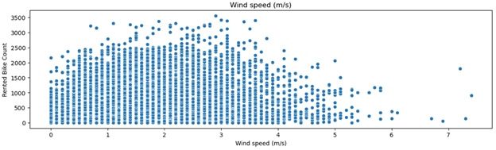

  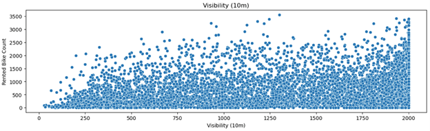

  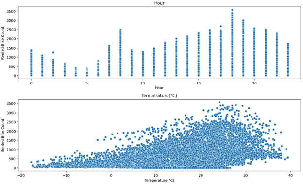

### Insights  
- Temp ↑ → Rentals ↑  
- Wind ↑ → Rentals ↓  
- Visibility ↑ → Rentals ↑  
- Rental peaks: **17:00–20:00**

---

## 🕒 Seasonal Rental Trends

  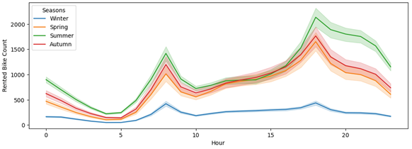

- **Summer** → highest demand  
- **Winter** → lowest  

---

## 🔥 Correlation Heatmap

  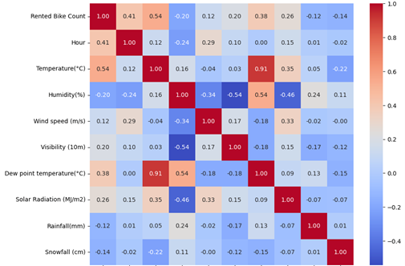

Strongest correlations with rental demand:

- **Temperature** → +0.54  
- **Hour** → +0.41  
- **Humidity** → –0.20  

---

# 🔍 **Part 2 — Clustering Analysis**

## 🔢 K-means Clustering

- Features normalized  
- Tested **k = 1 to 10**  
- Elbow method used to select k

  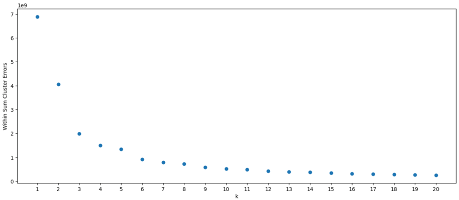
  
<em>Elbow Plot — Optimal Clusters ≈ 4.</em>

### ✔ Interpretation  
- WCSS drops steeply until **k = 4**  
- After k = 4 → diminishing returns  
➡ **Optimal Number of Clusters = 4**

---

## 🌳 Hierarchical Clustering (Ward)

  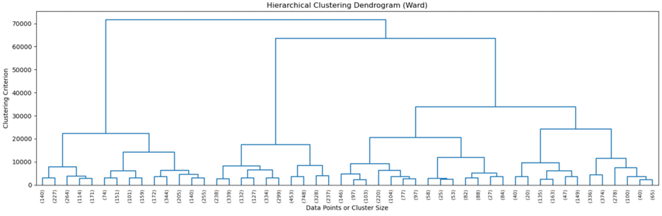
  
<em>Dendrogram showing clear 4-cluster structure.</em>

### ✔ Interpretation  
- Large vertical merge distances identify stable groups  
- Cutting at height ≈ 30,000 yields **4 clusters**  
- Confirms K-means result

---

## 🧠 Clustering Insights

Cluster tendencies across weather conditions:

| Cluster | Characteristics | Rental Impact |
|--------|-----------------|----------------|
| **C1** | High temp, clear skies, good visibility | 🔼 High rentals |
| **C2** | Cold temp, low solar radiation | 🔽 Low rentals |
| **C3** | Rainfall / Snowfall | 🔽 Very low rentals |
| **C4** | Warm, slightly cloudy, moderate wind | Moderate rentals |

These clusters can support **inventory planning**, **weather-based promotions**, and **real-time bike redistribution strategies**.

---

# 🤖 **Part 3 — Machine Learning Models**

## 🔧 Data Processing

- Rented Bike Count converted into **categories** (Low / Medium / High) for classification  
- Train/Test split: **70% / 30%**

---

# 🖥️ **Model 1 — Support Vector Machine (SVM)**

- **Accuracy:** 0.7899  
- **Precision:** 0.7767  
- **Recall:** 0.7899  
- **F1:** 0.7793  

  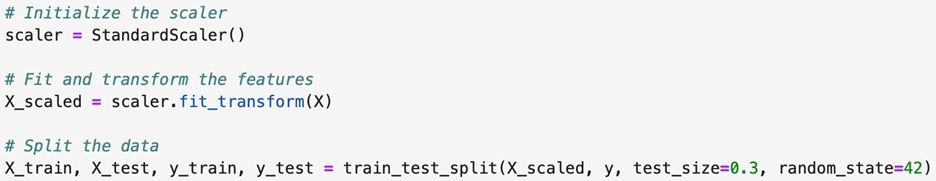

  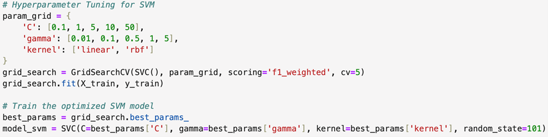

  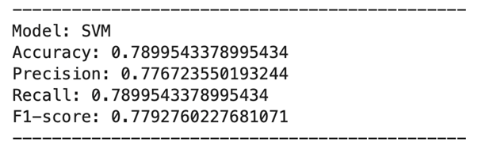

---

# 🌲 **Model 2 — Random Forest**

- **Accuracy:** 0.8002  
- **Precision:** 0.7921  
- **Recall:** 0.8002  
- **F1:** 0.7950  

  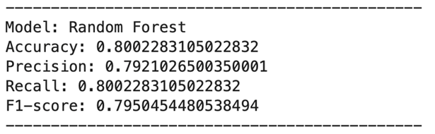

🏆 **Best Model Overall**

---

# ⚡ **Model 3 — Gradient Boosting**

- **Accuracy:** 0.7983  
- **Precision:** 0.7894  
- **Recall:** 0.7983  
- **F1:** 0.7920  

  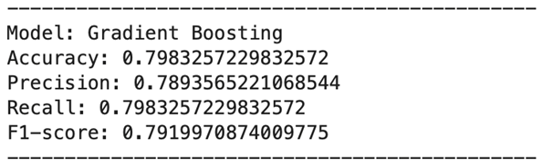

---

# 📉 **Part 4 — Multiple Linear Regression (OLS)**

  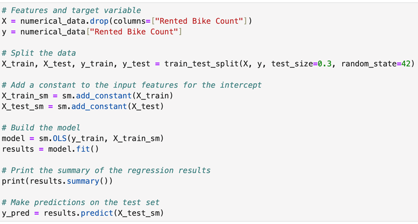

  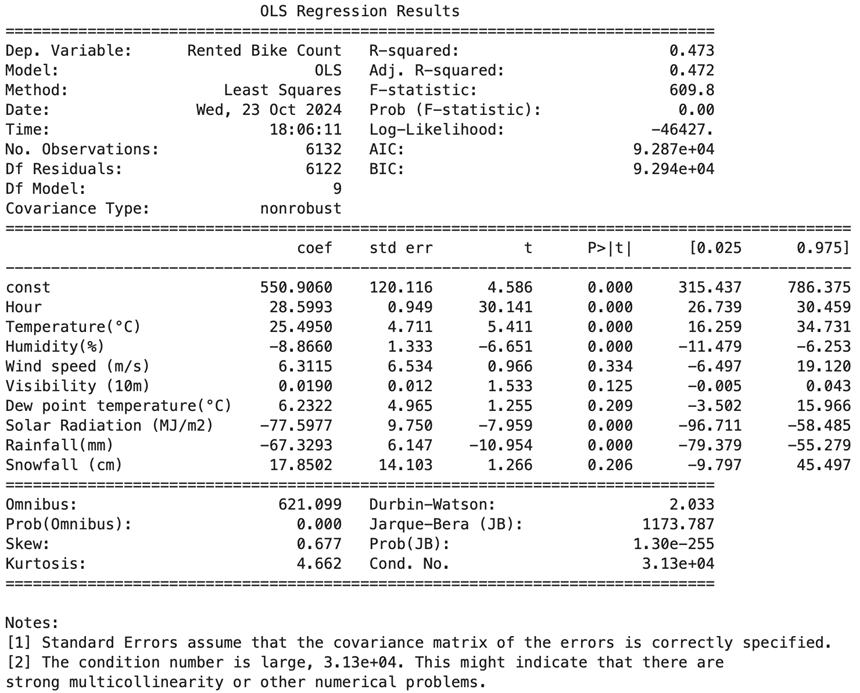

### Key Coefficients

- **Hour:** +28.6  
- **Temperature:** +25.5  
- **Humidity:** –8.87  
- **Rainfall:** –67.3  

### Model Strength  
- **R² = 0.473**  
- **F-statistic = 609.8** (p < 0.001)  
➡ Moderately strong linear model

---

# 🧠 Final Insights

### 📌 Clustering Insights
- Weather and environmental factors naturally form **4 meaningful clusters**  
- Useful for **inventory planning**, **weather prediction strategy**

### 📌 EDA Insights
- Rentals peak around **5 PM–8 PM**  
- Best temperature range: **20°C–30°C**  
- Visibility improves demand; wind reduces demand

### 📌 ML Insights
- **Random Forest** performs best for rental classification  
- Weather + time features predict demand effectively  
- Regression model quantifies rental impact of each feature

---

# 🧠 Skills Demonstrated

- Python EDA (seaborn, matplotlib)  
- K-means & Hierarchical Clustering (scikit-learn, SciPy)  
- Machine Learning Classification  
- Linear Regression with statsmodels  
- Data preprocessing and feature engineering  
- Interpretation of temporal + weather patterns  

